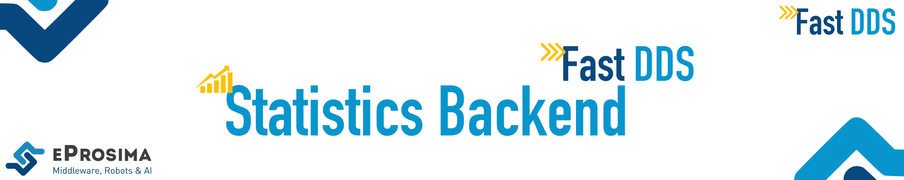

 

    <strong>
        <a href="https://eprosima.com/index.php/downloads-all">Download</a>
        &nbsp;&nbsp;•&nbsp;&nbsp;
        <a href="https://fast-dds-statistics-backend.readthedocs.io/en/latest/">Docs</a>
        &nbsp;&nbsp;•&nbsp;&nbsp;
        <a href="https://eprosima.com/index.php/company-all/news">News</a>
        &nbsp;&nbsp;•&nbsp;&nbsp;
        <a href="https://twitter.com/EProsima">Twitter</a>
        &nbsp;&nbsp;•&nbsp;&nbsp;
        <a href="mailto:info@eprosima.com">Contact Us</a>
    </strong>

  

    
    
    
    
    
     
    
    
    
    

  

*eProsima Fast DDS Statistics Backend* is a C++ library that provides collection and procession the statistics measurements reported by *Fast DDS Statistics Module*.
The Backend provides a easy-to-use and user friendly API that abstracts the details of receiving and processing
*Fast DDS* statistical data, so that applications can focus on providing great user experiences.
*Fast DDS Statistics Backend* allows for:

* Monitoring the various aspects reported by the Statistics Module for as many DDS Domains and *Fast DDS* Discovery Server network as desired.
* Retrieve the DDS network graph.
* Retrieve QoS settings about the DDS entities deployed in the network.
* Receive notification on statistics updates for various events using a listener-callback mechanism.
* Check whether an entity is active.
* Retrieve statistics on all the aspects of the communication reported by the *Fast DDS Statistics Module*, with the possibility of specifying time windows, bins, and different statistics to apply.

## Commercial support

Looking for commercial support? Write us to info@eprosima.com

Find more about us at [eProsima’s webpage](https://eprosima.com/).

## Documentation

You can access the documentation online, which is hosted on [Read the Docs](https://fast-dds-statistics-backend.readthedocs.io).

* [Introduction](https://fast-dds-statistics-backend.readthedocs.io/en/latest/)
* [Installation Manual](https://fast-dds-statistics-backend.readthedocs.io/en/latest/rst/installation/linux_installation.html)
* [Developer Manual](https://fast-dds-statistics-backend.readthedocs.io/en/latest/rst/statistics_backend/statistics_backend.html)
* [Examples](https://fast-dds-statistics-backend.readthedocs.io/en/latest/rst/full_example.html)
* [Release Notes](https://fast-dds-statistics-backend.readthedocs.io/en/latest/rst/notes/notes.html)

